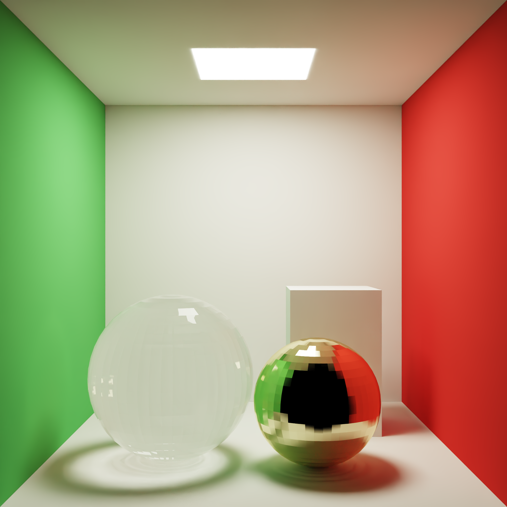
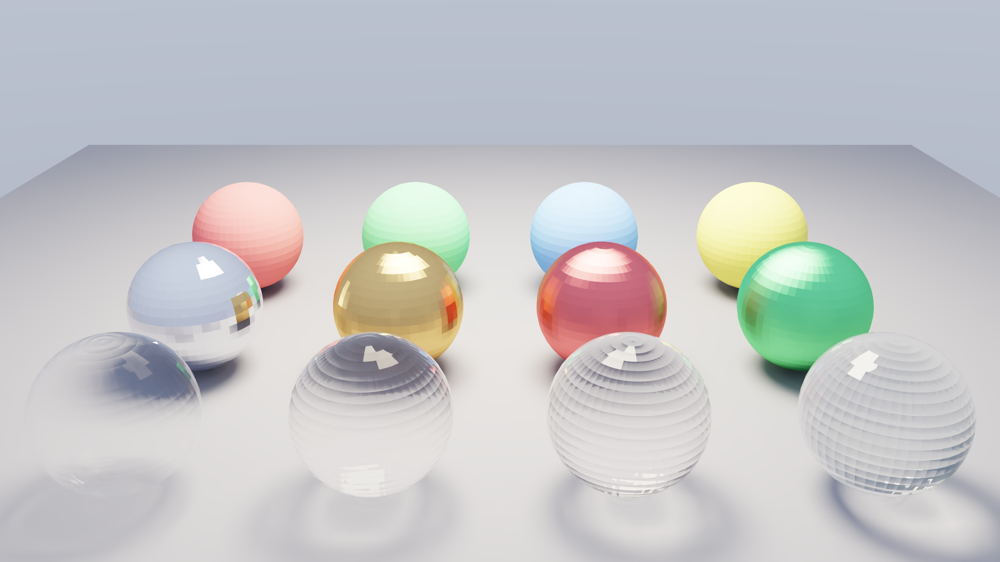
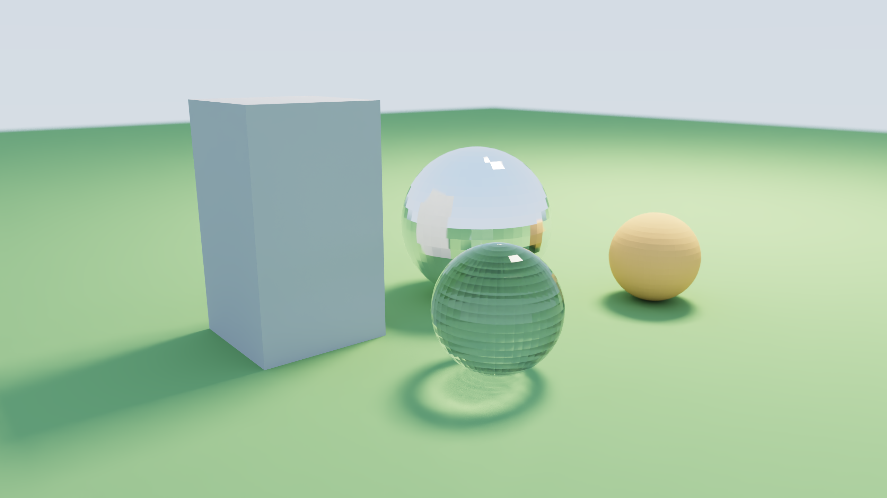
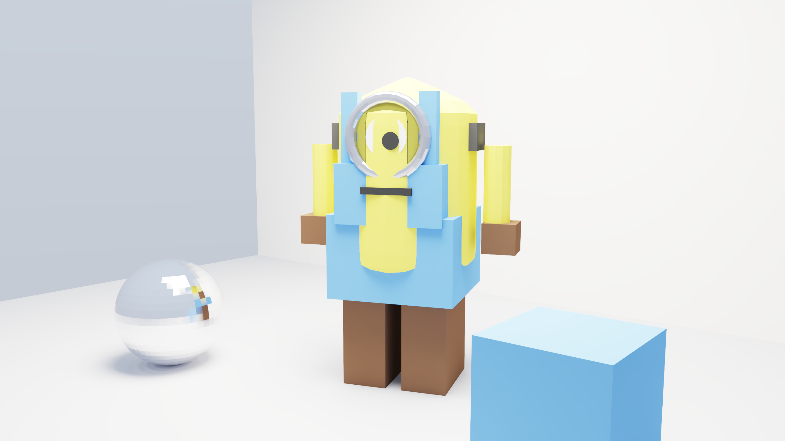

# LumenCore

GPU path tracer built with **OptiX 9 + CUDA 13**, validated on **RTX 5090**.

See [CHANGELOG.md](CHANGELOG.md) for version history.

## Gallery

### Cornell Box



Classic enclosed room with red / green walls, a glass sphere, a metal sphere, and a ceiling area light. Shows soft shadows, color bleeding, refraction caustics, and Next Event Estimation.

### Materials Ball



Material chart of diffuse, metal, and glass spheres under an area light. Useful for checking roughness / metallic / transmission response of the simplified PBR model.

### Outdoor Env



Open ground scene with chrome and glass props, soft sunlight, and a gradient environment. Includes a light depth-of-field camera.

### Yellow Buddy (OBJ character)



Studio portrait of **Yellow Buddy**, an original low-poly capsule character loaded from Wavefront OBJ (`assets/models/yellow_buddy.obj`). Multi-material `usemtl` groups drive yellow body, blue overalls, metal goggles, glass lens, and boots. Inspired by the familiar “yellow helper” silhouette; not affiliated with any trademarked property.

---

## Features

- Unidirectional path tracing + Next Event Estimation (quad area lights)
- Russian Roulette; diffuse / metal / glass materials
- Triangle-mesh GAS on OptiX RT Cores
- Wavefront **OBJ** import (`load_obj`, optional `usemtl` material map)
- Progressive accumulation + OptiX Denoiser (albedo/normal guided)
- ACES tone map + gamma PNG output

## Requirements

- NVIDIA GPU with RT Cores (tested: RTX 5090)
- Docker image with CUDA 13+ toolkit (default: `spectraldock-dev:cuda13.3`)
- OptiX denoiser weights at `/usr/share/nvidia/nvoptix.bin` (from the driver install)
- Vendored OptiX 9 headers under `third_party/optix`

## Quick start

```bash
chmod +x docker/run.sh

# Configure + build (artifacts under /tmp/LumenCore-build)
./docker/run.sh 'cmake -S /work -B /out -DCMAKE_CUDA_ARCHITECTURES=120 && cmake --build /out -j$(nproc)'

# Render examples → /tmp/LumenCore-out
./docker/run.sh './bin/cornell /results/cornell.png 256 1'
./docker/run.sh './bin/materials_ball /results/materials_ball.png 256 1'
./docker/run.sh './bin/outdoor_env /results/outdoor_env.png 256 1'
./docker/run.sh './bin/yellow_buddy /results/yellow_buddy.png 256 1'
```

CLI: `program <output.png> [spp] [denoise=1|0]`

Set `NRTX_DOCKER_IMAGE` if your CUDA container has a different name (default: `nvidia/cuda:13.0.1-devel-ubuntu24.04`). The helper script mounts host OptiX/RTX driver libraries and denoiser weights. Build/render outputs use local `/tmp` so NFS source trees can stay read-only.

## Layout

| Path | Role |
|------|------|
| `include/nrtx` | Host scene API |
| `src/device` | OptiX programs (`.cu` → OptiX-IR) |
| `src/host` | Context, GAS, OBJ loader, denoiser, PNG I/O |
| `assets/models` | Character OBJ / MTL |
| `examples` | cornell / materials_ball / outdoor_env / yellow_buddy |
| `outputs/` | Sample renders from RTX 5090 |

## Performance (RTX 5090, 256 spp, denoised)

| Scene | Resolution | Path trace |
|-------|------------|------------|
| cornell | 2048×2048 | ~1.51 s |
| materials_ball | 2560×1440 | ~0.50 s |
| outdoor_env | 2560×1440 | ~0.43 s |
| yellow_buddy | 2560×1440 | ~0.73 s |

## License

Sample code for learning and experimentation. OptiX headers remain under NVIDIA’s OptiX SDK license terms. Yellow Buddy is an original asset bundled with this repository.
