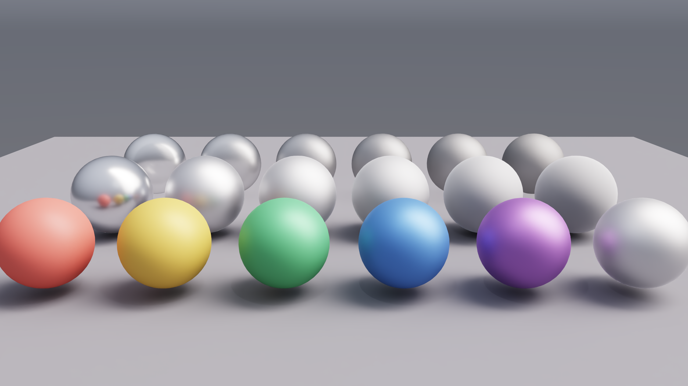
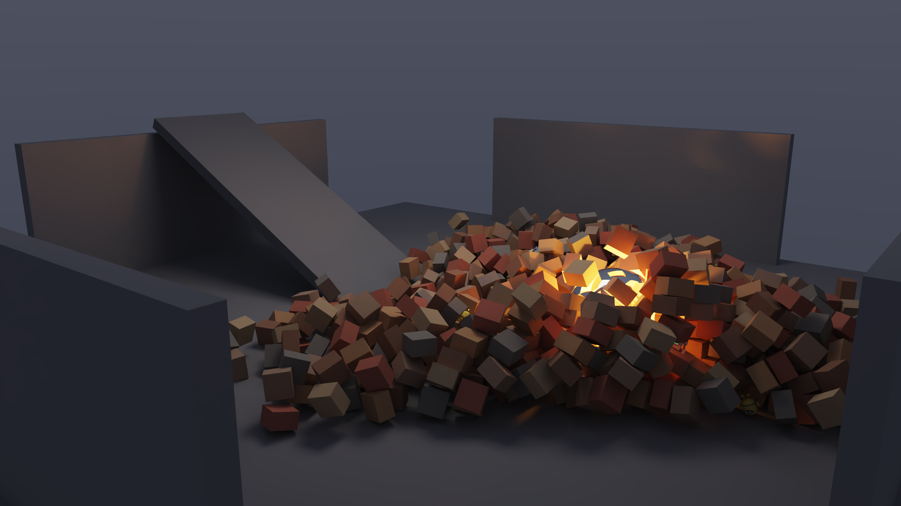
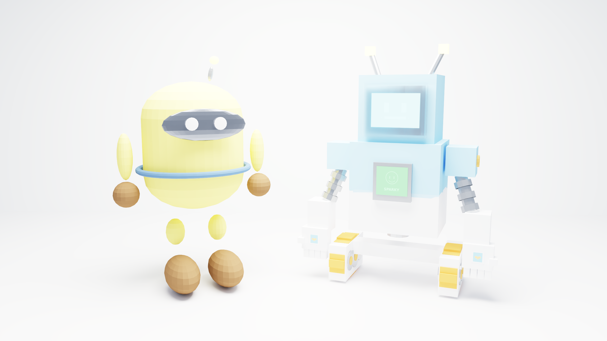

# LumenCore

NVIDIA GPU dual-stack showcase: **PhysX 5** rigid-body dynamics + **OptiX 9 / CUDA 13** path tracing, validated on **RTX 5090**.

See [CHANGELOG.md](CHANGELOG.md) for version history.

## Gallery

### GGX Studio (HDRI + roughness)



Metal roughness row + metallic color row under an importance-sampled **HDRI** (`Scene.load_env_map`) with GGX microfacet BRDF and balance MIS. Glass sphere keeps the ideal dielectric path for reference.

### Fireplace (volumetric flame)


Dark stone hearth lit almost entirely by a **procedural flame volume** (noise density + ray-marched emission/absorption) with a warm NEE proxy light. **Sparky** and **Capsule Mascot** sit by the fire in plastic / chrome / yellow / glass material variants.

### PhysX Collapse



Studio brick tower knocked over by a heavy **glass fireball** (procedural flame volume inside) rolling down a ramp in a darker studio. Brick-sized **Sparky** and **Capsule Mascot** are mixed into the tower. **PhysX** advances GPU rigid bodies; each sampled frame rebuilds triangle meshes from actor poses and is path-traced with **OptiX**. Frame sequence: `outputs/physx_collapse/`; homepage hero: `outputs/physx_collapse.png`.

### Cornell Box


Classic enclosed room with red / green walls, a glass sphere, a metal sphere, and a ceiling area light. Shows soft shadows, color bleeding, refraction caustics, and Next Event Estimation.

### Materials Ball


Material chart of diffuse, metal, and glass spheres under studio **HDRI** plus a soft area fill. Useful for checking roughness / metallic / transmission with the GGX PBR model.

### Outdoor Env


Open ground scene with chrome and glass props lit primarily by HDRI, soft fill light, and light depth-of-field.

### Sparky + Capsule Mascot



Studio duo: **Sparky** beside **Capsule Mascot**, lit by two overhead **spotlights** aimed at each character (`Scene.add_spot_light`). Multi-material OBJs with glass/emissive accents on Sparky and a warm yellow capsule mascot (`capsule_mascot.obj`, CC0).

### Water Pool


Open deep water with a **calm procedural surface** (`make_water_surface` + analytic normals, IOR 1.33 + Beer-Lambert absorption over ~4 m depth). **Sparky** and **Capsule Mascot** stand on a wooden pier; submerged rocks cue depth and refraction.

---

## Features

- **PhysX 5 + OptiX 9** — GPU PhysX rigid bodies (required) + OptiX path tracing (`PhysXWorld` → poses → meshes → path tracer)
- **Procedural flame volumes** — `Scene.add_flame_volume` (noise density, ray-marched emission, NEE proxy light)
- **Python scene API** (`import lumencore`) — each demo is a Python script
- Unidirectional path tracing + Next Event Estimation (quad area lights + spot lights + HDRI)
- Russian Roulette; **GGX** opaque materials + ideal glass
- **HDRI env maps** (`Scene.load_env_map`) with CDF importance sampling and balance MIS
- Triangle-mesh GAS on OptiX RT Cores
- Wavefront **OBJ** import (`load_obj`, optional `usemtl` material map, **UV / `vt`**)
- Albedo textures (`Scene.add_texture`, `Material.albedo_tex`)
- Spot lights (`Scene.add_spot_light`)
- Dielectric **Beer-Lambert absorption** (`Material.absorption`) for water / tinted glass
- Procedural water surfaces (`make_water_surface` with analytic normals)
- Optional mesh **vertex normals** for smooth shading
- Progressive accumulation + OptiX Denoiser (albedo/normal guided)
- ACES tone map + gamma PNG output

## Requirements

- NVIDIA GPU with RT Cores (tested: RTX 5090)
- Docker with CUDA 13+ toolkit (default base: `nvidia/cuda:13.0.1-devel-ubuntu24.04`; `docker/run.sh` builds `lumencore-build:cuda13` with Python headers)
- OptiX denoiser weights at `/usr/share/nvidia/nvoptix.bin`
- Vendored OptiX 9 headers under `third_party/optix`
- PhysX 5 static libs under `third_party/physx/lib` (run `scripts/setup_physx.sh` once; needs network on first fetch). GPU rigid bodies require `third_party/physx/bin/libPhysXGpu_64.so` on `LD_LIBRARY_PATH` (`docker/run.sh` sets this). PhysX is GPU-only; init fails if GPU PhysX is unavailable.
- Network on first CMake configure (FetchContent downloads pybind11)

## Quick start

```bash
chmod +x docker/run.sh scripts/setup_physx.sh

# One-time PhysX install (skip if third_party/physx/lib already populated)
./scripts/setup_physx.sh

# Configure + build Python module → /tmp/LumenCore-build/python/lumencore*.so
./docker/run.sh 'cmake -S /work -B /out -DCMAKE_CUDA_ARCHITECTURES=120 && cmake --build /out -j$(nproc)'

# Render scenes (PYTHONPATH is set by docker/run.sh)
./docker/run.sh 'python3 /work/python/scenes/ggx_studio.py /results/ggx_studio.png 256 1'
./docker/run.sh 'python3 /work/python/scenes/cornell.py /results/cornell.png 256 1'
./docker/run.sh 'python3 /work/python/scenes/materials_ball.py /results/materials_ball.png 256 1'
./docker/run.sh 'python3 /work/python/scenes/outdoor_env.py /results/outdoor_env.png 256 1'
./docker/run.sh 'python3 /work/python/scenes/sparky.py /results/sparky.png 256 1'
./docker/run.sh 'python3 /work/python/scenes/physx_collapse.py /results/physx_collapse.png 128 1 1'
./docker/run.sh 'python3 /work/python/scenes/fireplace.py /results/fireplace.png 256 1'
./docker/run.sh 'python3 /work/python/scenes/water_pool.py /results/water_pool.png 256 1'
```

CLI: `python3 <scene.py> [out.png] [spp] [denoise=1|0]`

`physx_collapse` writes a frame sequence under `<out_stem>/` plus a gallery hero PNG (pick any frame for the homepage).

`fireplace` extra arg: `[time]` — flame noise phase / scroll offset.

`water_pool` extra arg: `[time]` — procedural water wave phase.

Example API usage:

```python
import lumencore as lc

scene = lc.Scene()
mat = scene.add_material(lc.Material(base_color=(0.8, 0.8, 0.8), roughness=0.5))
scene.add_mesh(lc.make_quad((0, 0, 0), (1, 0, 0), (0, 0, 1), mat))
scene.add_flame_volume(
    center=(0.5, 0.4, 0.5),
    half_extents=(0.2, 0.4, 0.15),
    emission_scale=(40, 16, 3),
    time=1.5,
)
cam = lc.Camera(eye=(0.5, 0.5, -1.35), lookat=(0.5, 0.5, 0.5), fov_y_deg=40, aspect=1.0)
cfg = lc.RenderConfig(width=2048, height=2048, spp=64, denoise=True, output_path="out.png")
lc.Renderer().render(scene, cam, cfg)
```

## Layout

| Path | Role |
|------|------|
| `bindings/` | pybind11 module `lumencore` |
| `python/scenes/` | Scene scripts (ggx_studio, cornell, materials_ball, outdoor_env, sparky, physx_collapse, fireplace, water_pool) |
| `include/nrtx` | C++ host scene API + `PhysXWorld` |
| `src/device` | OptiX programs (`.cu` → OptiX-IR) |
| `src/host` | Context, GAS, PhysX wrapper, OBJ/HDRI loaders, denoiser, PNG I/O |
| `scripts/setup_physx.sh` | Fetch/build PhysX 5 into `third_party/physx` |
| `scripts/gen_sparky.py` | Procedural Sparky OBJ + albedo atlas |
| `scripts/gen_studio_hdr.py` | Procedural studio Radiance HDR |
| `assets/models` | Character OBJ / MTL / textures |
| `assets/env` | HDRI environment maps |
| `outputs/` | Sample renders from RTX 5090 |

## Performance (RTX 5090, denoised)

| Scene | Resolution | Notes |
|-------|------------|-------|
| ggx_studio | 2560×1440 | HDRI + GGX roughness / metallic showcase |
| cornell | 2048×2048 | ~1.51 s @ 256 spp |
| materials_ball | 2560×1440 | HDRI-lit material chart |
| outdoor_env | 2560×1440 | HDRI + soft fill |
| sparky | 2560×1440 | Sparky + Capsule Mascot duo |
| physx_collapse | 2560×1440 | ~0.24 s path-trace / frame @ 96 spp; PhysX backend `gpu` |
| fireplace | 2560×1440 | ~1.50 s @ 256 spp (volume march + NEE) |
| water_pool | 2560×1440 | open deep water + pier; Beer-Lambert depth |

## License

Sample code for learning and experimentation. OptiX headers remain under NVIDIA’s OptiX SDK license terms. PhysX is under the NVIDIA PhysX SDK license (see upstream `NVIDIA-Omniverse/PhysX`). Sparky is an original asset bundled with this repository. Capsule Mascot is CC0-1.0.
