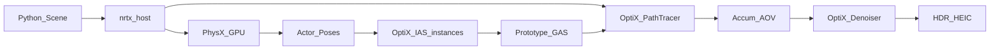

# 01 项目总览

## 这套项目在干什么？

LumenCore 是一个**教学向**的 NVIDIA GPU 双栈演示：

1. **PhysX 5** 在 GPU 上算刚体（砖块倒塌、球滚下坡）。
2. **OptiX 9** 用路径追踪把场景画成图片（软阴影、反射、折射、体积火焰等）。

你可以把它想成两台机器接力：物理引擎负责「东西怎么动」，渲染器负责「眼睛看见什么」。

*图：刚体倒塌 + 玻璃火球。物理位姿每帧更新后，再交给路径追踪。*

## 大图：数据怎么流？

*图：从 Python 场景脚本到最终 HEIC 的主数据流。*

逐步说明：

| 步骤 | 谁在做 | 含义 |
|------|--------|------|
| 写场景 | `python/scenes/*.py` | 加网格、材质、灯光，或驱动 PhysX |
| Host 准备 | `src/host/renderer.cpp` 等 | 上传 GPU 缓冲、建加速结构 |
| （可选）仿真 | `PhysXWorld` | `step` → `get_pose` |
| 光线追踪 | `src/device/shaders.cu` | 每个像素发射多条路径 |
| 后处理 | Denoiser + HEIC | 降噪后写 HDR HEIC（PQ / Rec.2020） |

没有 PhysX 的场景（如 Cornell Box）会跳过中间的仿真步，直接渲染静态网格。

## 仓库里该看哪些目录？

| 路径 | 角色 |
|------|------|
| `python/scenes/` | 演示场景（你最先改这里） |
| `bindings/` | pybind11 模块 `lumencore` |
| `include/nrtx/` | C++ 场景 / PhysX / HDRI API |
| `src/common/` | 设备与主机共用：`bsdf.h`、`LaunchParams.h` |
| `src/device/` | OptiX 程序（`.cu` → OptiX-IR） |
| `src/host/` | Context、GAS、渲染、PhysX、OBJ、HDRI |
| `outputs/` | 示例渲染结果 |
| `docs/report/` | 你正在读的技术报告 |

## 和「游戏引擎实时渲染」有什么不同？

- **光栅化**（游戏常见）：把三角形投影到屏幕，用近似光照，追求实时帧率。
- **路径追踪**（本项目）：从相机往场景扔光线，按物理积分估计每个像素的颜色，更准确，但更慢；靠 GPU RT Core + OptiX 加速求交。

LumenCore 选路径追踪，是为了把教材里的渲染方程「算出来给你看」，而不是做 60 FPS 游戏。

## 本项目做到了什么、没做什么？

**有：**

- 单向路径追踪 + 俄罗斯轮盘
- GGX 不透明材质、**GGX 粗糙透射玻璃**、**切线空间法线贴图**
- 面光 / 聚光 NEE、HDRI + 平衡 MIS
- Beer-Lambert 介质、火焰体积
- PhysX GPU 刚体与 **OptiX IAS 实例化**（pose → instance transform）

**没有（别在报告里期待）：**

- 双向路径追踪（BDPT）、光子映射
- 完整光谱渲染
- 玻璃与面光的完整 NEE/MIS（玻璃路径暂不做下一事件估计）
- 三角形网格刚体（PhysX 侧主要是盒 / 球；外观 OBJ 仍用盒碰撞）
- ORM / 金属度贴图、各向异性（法线贴图以外的完整贴图集）
## 小结

- LumenCore = **PhysX 动** + **OptiX 画**。
- 入口在 Python；核心数学在 `shaders.cu` / `bsdf.h`；工程胶水在 `renderer.cpp`。

下一章从「光为什么能用积分描述」讲起：[02 渲染方程入门](02-rendering-equation.md)。
