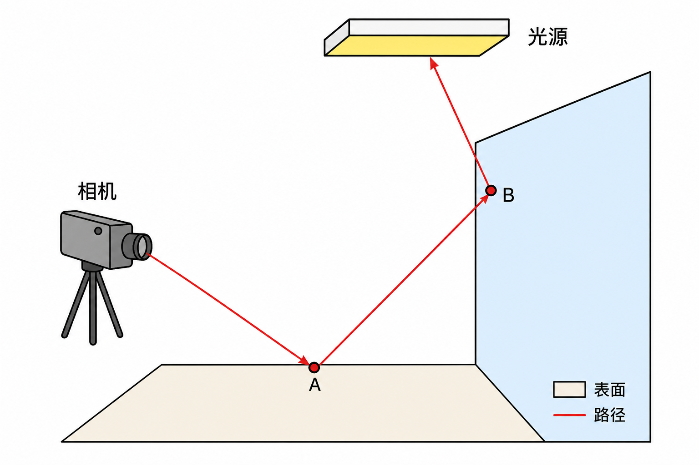

# 03 蒙特卡洛与路径追踪

## 蒙特卡洛一句话

若你要算期望 $\mathbb{E}[f(X)]$，可以抽很多独立样本 $`X_1,\ldots,X_N`$，用平均近似：

```math
\frac{1}{N}\sum_{i=1}^N f(X_i)\;\approx\;\mathbb{E}[f(X)].
```

积分 $\int g(x)\,dx$ 也可以写成期望：先选一个概率密度 $p(x)$，令 $f(X)=g(X)/p(X)$。于是

```math
\int g(x)\,dx = \mathbb{E}\!\left[\frac{g(X)}{p(X)}\right].
```

**样本越多，噪声越小**——所以路径追踪常说 spp（samples per pixel）。

## 一条路径长什么样？



*图：从相机出发，撞到表面，再弹到光源。每段都贡献一部分颜色。*

本项目中，每个像素大致这样：

1. 通过相机生成主光线（可带薄透镜景深抖动）。
2. `optixTrace` 求最近交点。
3. 在交点上：加自发光 →（可选）NEE 连灯 → 采样 BSDF 决定下一方向。
4. 用 **throughput（吞吐）** 乘上「材质响应 / pdf × 余弦」等权重，继续弹射。
5. 打到环境 / 灯，或俄罗斯轮盘杀死路径，或达到最大深度。

对应代码：`shaders.cu` 里 `__raygen__rg` 循环调用 `trace_radiance`，以及 `__closesthit__radiance`。

## Throughput：为什么要累乘？

设当前路径「还能带到相机的比例」为吞吐 $T$（代码里 `prd->throughput`，初始为 1）。

每次弹射：

```math
T \leftarrow T \cdot \frac{f_r\cdot\cos\theta}{p(\omega)}.
```

最终像素颜色是各次「撞到发光体」时 $`T \times L_e`$ 的累加。  
这样，越晚、越暗的材质，对结果贡献越小——符合物理。

## 重要性采样（直觉）

若 $p$ 选得和被积函数形状接近，方差更低。例如：

- 漫反射：更常朝法线方向采样（余弦半球）。
- 光滑金属：更常朝镜面反射附近采样（GGX VNDF）。

本项目不透明材质的采样在 `sample_opaque_bsdf`（`bsdf.h`）。

## 俄罗斯轮盘（Russian Roulette）

路径不能无限长。深度超过阈值后（本项目约 `depth > 3`）：

- 以概率 $q$ **直接终止**；
- 若存活，把吞吐除以 $1-q$，保持无偏。

对应 `shaders.cu` 中 closesthit 末尾的 RR 代码。

## 像素如何平均？

每个像素发射 `spp` 条独立路径，把 radiance 累加到 `accum_buffer`，再按样本数做递推平均（progressive accumulation）。去噪与色调映射见 [08](08-host-pipeline.md)。

## 小结

- 路径追踪用蒙特卡洛估渲染方程。
- 吞吐记录「这条路径还剩多少权重」。
- spp ↑ → 噪声 ↓；RR 控制路径长度。

下一章：[04 材质与 BSDF](04-materials-bsdf.md)。
