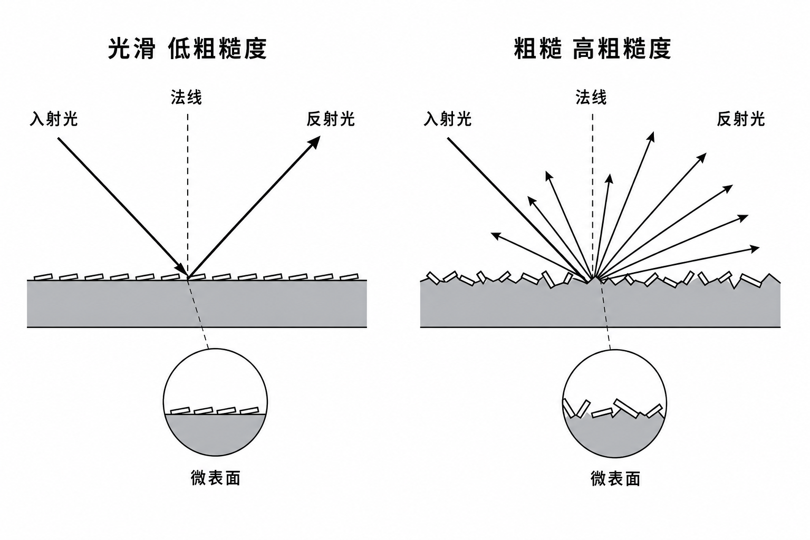
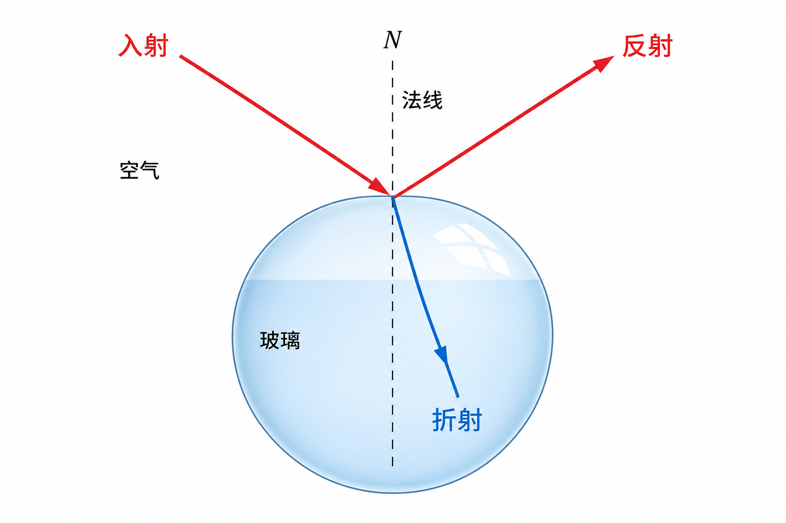

# 04 材质与 BSDF

## BSDF 是什么？

**BSDF**（双向散射分布函数）描述：光从 $\omega_i$ 进来，有多大比例往 $\omega_o$ 出去。  
只反射、不透射时也称 **BRDF**。

在渲染方程里，它就是 $f_r$。单位要保证能量不凭空变多（实现上会做各种夹紧与近似）。

## 本项目的材质参数

Python / C++ 的 `Material` 大致包括：

| 字段 | 作用 |
|------|------|
| `base_color` | 漫反射底色或金属反射色 |
| `metallic` | 0 电介质 ↔ 1 金属 |
| `roughness` | 0 光滑 ↔ 1 粗糙 |
| `transmission` | >0.5 走理想玻璃路径 |
| `ior` | 折射率（玻璃） |
| `emission` | 自发光 |
| `absorption` | 介质 Beer-Lambert 吸收 |
| `albedo_tex` | 可选漫反射纹理 |

不透明路径走 GGX；`transmission` 高则走理想电介质（镜面反射/折射），**目前没有粗糙透射**。

## 漫反射（Lambert）部分

理想漫反射 BRDF 常取：

$$
f_{\text{diff}}=\frac{\text{base\_color}}{\pi}.
$$

采样用余弦半球：更常抽到法线附近方向，pdf 含 $\cos\theta/\pi$。

## 微表面与 GGX

真实金属/塑料高光不是完美镜面。微表面模型认为：宏观表面由许多微小镜面「小面」组成，法线分布由粗糙度控制。

*图：左光滑、右粗糙。粗糙时反射方向更分散，高光更糊。*

Cook–Torrance 风格镜面项可写成：

$$
f_s=\frac{D\cdot G\cdot F}{4\,(n\cdot\omega_o)\,(n\cdot\omega_i)}.
$$

本项目（`src/common/bsdf.h`）：

| 符号 | 实现 |
|------|------|
| $D$ | GGX 法线分布 `ggx_d` |
| $G$ | Smith–GGX 几何遮挡 `smith_g_ggx` |
| $F$ | Schlick Fresnel `fresnel_schlick3` |
| $F_0$ | 电介质约 0.04；金属则用 `base_color` |

不透明最终 BRDF ≈ **漫反射 × (1−metal)×(1−F) + 镜面**，见 `eval_opaque_bsdf`。

### 采样：VNDF

`sample_ggx_vndf` 按可见法线分布抽微表面法线 $h$，再关于 $h$ 反射得到 $\omega_i$。  
漫反射与镜面用随机选择混合，pdf 在 `eval_opaque_bsdf` 里一并估算，供 MIS 使用。

*图：后排金属球粗糙度递增；前排金属度递增。对应 `python/scenes/ggx_studio.py`。*

## 理想玻璃

当 `transmission > 0.5`：

1. 用 Schlick 近似算反射概率；
2. 以该概率反射，否则折射（Snell）；
3. 进入介质时可设置 `medium_sigma = absorption`（Beer-Lambert，见 [06](06-volumes-media.md)）。

*图：空气→玻璃界面上，入射光分成反射与折射。掠射角时反射更强（Fresnel）。*

玻璃路径在实现里近似为 **delta**（`pdf=1`，吞吐不除 pdf），且不与 NEE 做不透明那套 MIS。

## 代码地图

| 函数 | 文件 | 作用 |
|------|------|------|
| `eval_opaque_bsdf` | `bsdf.h` | 求值 + pdf |
| `sample_opaque_bsdf` | `bsdf.h` | 采样下一方向 |
| closesthit 玻璃分支 | `shaders.cu` | Fresnel + refract |
| `Material` | `nrtx.h` / bindings | 主机侧参数 |

## 小结

- 不透明：GGX 金属度-粗糙度。
- 玻璃：理想折射/反射 + 可选吸收。
- 看 `ggx_studio` 最容易对照参数。

下一章：[05 NEE、MIS 与 HDRI](05-nee-mis-hdri.md)。
