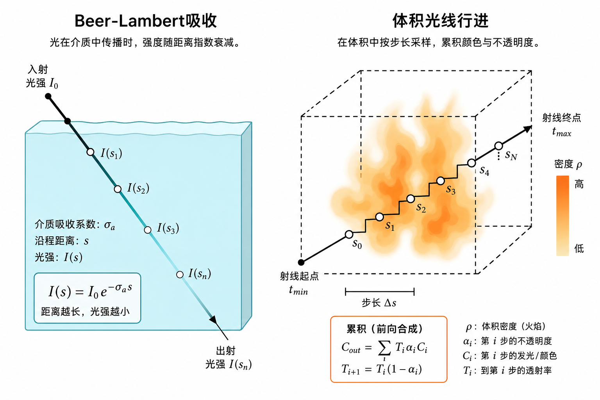
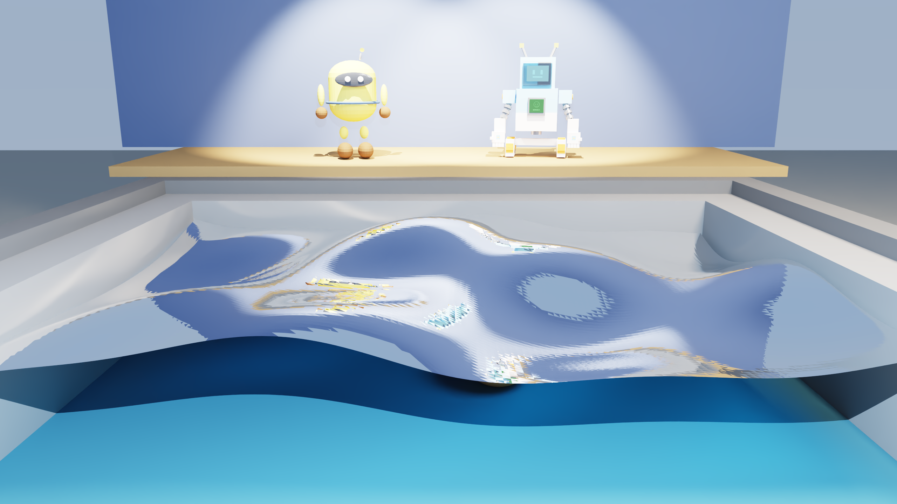
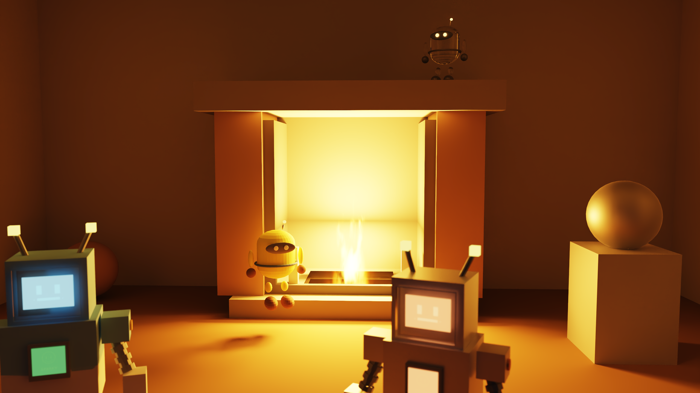

# 06 体积与介质

## 均匀介质：Beer–Lambert

光在有色玻璃 / 水里走距离 \(d\)，强度近似按指数衰减：

\[
L(d)=L(0)\,e^{-\sigma_t d},
\]

其中 \(\sigma_t\) 是消光系数（本项目用 `Material.absorption` 的 RGB，按通道衰减）。

实现：路径进入玻璃时设置 `prd->medium_sigma`；下一次命中前用 `beer_attenuate` 乘到吞吐上。  
水面演示见 `python/scenes/water_pool.py`（IOR 1.33 + 吸收）。

*图：左——沿路径颜色变淡（吸收）；右——在 AABB 里逐步采样火焰密度。*

*图：开敞深水 + Beer-Lambert，深度越大越偏青。*

## 非均匀体积：火焰

火焰不是均匀雾，而是一块 AABB 里密度变化的发光介质。

`Scene.add_flame_volume`（`mesh.cpp`）会：

1. 存 `FlameVolume`（中心、半轴、发射强度、噪声尺度、时间相位等）；
2. 加一个带 `MATERIAL_FLAG_VOLUME_FLAME` 的盒子网格作代理；
3. 可选加一张代理面光做 NEE。

求交打到代理盒时，`integrate_flame_volume`（`shaders.cu`）：

1. 求射线与 AABB 的进出参数；
2. 分成多步（如 64），每步用噪声 / FBM 估密度；
3. 按密度累加发射、更新透过率 \(T_r\)；
4. 从盒子远侧面继续路径。

密度函数让火焰呈细丝状、底部更亮——这是艺术参数，不是第一性原理燃烧模拟。

*图：暗房间几乎全靠火焰体积 + 代理灯照明。*

## 玻璃火球（PhysX Collapse）

倒塌场景里有一颗**玻璃壳 + 内部火焰体积**：球心跟随 PhysX 位姿，每帧 `add_flame_volume(center=pose)`。  
阴影对玻璃透明，代理灯才能照亮砖堆。

## 小结

- 均匀介质：指数吸收。
- 火焰：AABB 内 ray march + 噪声密度 + 可选代理灯。
- 体积命中后仍可继续路径（透过率未耗尽时）。

下一章：[07 OptiX 实现](07-optix-implementation.md)。
