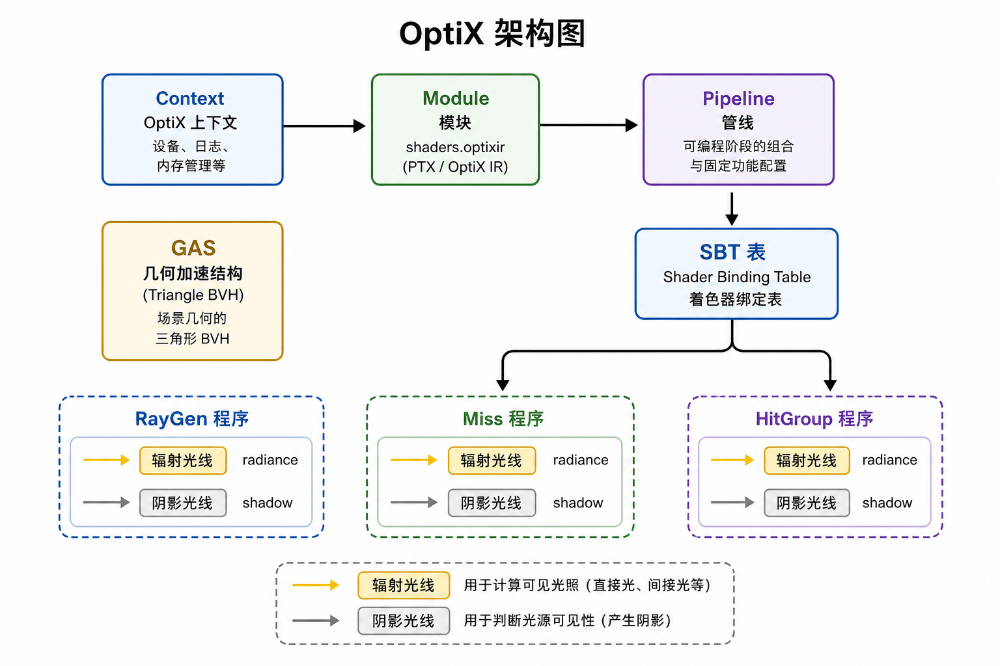
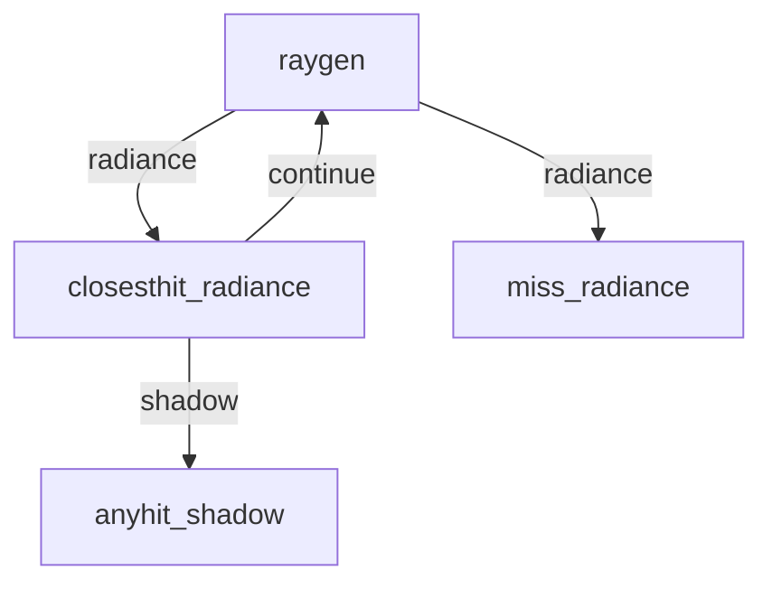

# 07 OptiX 实现

## OptiX 是什么？

**OptiX** 是 NVIDIA 的光线追踪 SDK：你写「射线生成 / 命中 / 未命中」等程序，它用 GPU 上的 BVH + RT Core 做高速求交。

本项目使用 OptiX 9，设备代码在 `src/device/shaders.cu`，编译为 OptiX-IR（`shaders.optixir`），由 `renderer.cpp` 加载。

*图：Context 管理 Module 与 Pipeline；GAS 存三角形加速结构；SBT 把射线类型绑到具体程序。*

## 核心对象（对照本仓库）

| 概念 | 本项目位置 | 作用 |
|------|------------|------|
| Device Context | `Renderer::Impl` | 连上 CUDA context |
| Module | `optixModuleCreate` | 装入编译好的设备程序 |
| Program groups | raygen / miss / hitgroup × 2 | 程序入口组合 |
| Pipeline | `optixPipelineCreate` | 可启动的整条链路 |
| GAS | 合并场景三角形后 `optixAccelBuild` | 几何加速结构 |
| SBT | Raygen / Miss / Hitgroup records | 启动时查「这条射线跑哪个程序」 |
| LaunchParams | `LaunchParams.h` + `__constant__ params` | 每帧上传的全局参数 |

Pipeline 选项里使用 `ALLOW_SINGLE_GAS`：整个场景一个 GAS 即可。

## 两种射线类型

1. **Radiance**：算颜色。走 closesthit / miss，可继续弹射。
2. **Shadow**：只问「中间有没有挡」——`TERMINATE_ON_FIRST_HIT`，anyhit 置 `occluded`。

常量：`RAY_TYPE_RADIANCE`、`RAY_TYPE_SHADOW`（见 `LaunchParams.h`）。

## 程序入口职责

| 入口 | 做什么 |
|------|--------|
| `__raygen__rg` | 像素循环、相机射线、路径循环、写 accum/AOV |
| `__closesthit__radiance` | 插值属性、着色、NEE、BSDF、体积 |
| `__miss__radiance` | 环境色 / HDRI，路径结束 |
| `__anyhit__shadow` | 火焰盒、玻璃可忽略；否则遮挡 |
| `__miss__shadow` | 未遮挡 |

命中时通过 `optixGetSbtDataPointer()` 取 `HitGroupData`（顶点、法线、材质 id 等）。

## Payload：路径状态怎么传来传去？

OptiX 用寄存器 payload 传指针。本项目把 `RadiancePRD`（原点、方向、吞吐、radiance、seed、depth、`last_pdf`…）打包成两个 32 位整数。  
每次 `optixTrace` 后，closesthit/miss 就地改 PRD，raygen 再决定是否继续。

## 与 CUDA 的关系

- Host 用 CUDA runtime 分配缓冲、拷贝 `LaunchParams`。
- 设备程序是 OptiX 语义，不是普通 `.cu` kernel 启动。
- Denoiser 也是 OptiX API（`optixDenoiserInvoke`）。

## 小结

- OptiX = 求交加速 + 可编程命中着色。
- 本项目：单 GAS、双射线类型、SBT 绑定、PRD 载荷。
- 精读：`renderer.cpp` 的 pipeline/SBT/GAS，`shaders.cu` 的五个入口。

下一章：[08 Host 管线与后处理](08-host-pipeline.md)。
