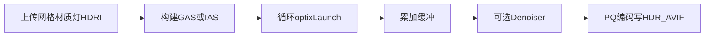

# 08 Host 管线与后处理

## 一次 `Renderer::render` 做什么？

入口：`src/host/renderer.cpp` 的 `Renderer::render(scene, camera, config)`。

*图：Host 侧从上传到出图。*

### 1. 加速结构：GAS 或 IAS

- **无 instance**（多数静态 demo）：多个 `Mesh` 拼成大数组，建一个世界空间 **GAS**。
- **有 `Scene.instances`**（PhysX）：每个原型网格单独建 GAS，再按位姿建 **IAS**；SBT 按 `mesh_index` 分 hitgroup。未实例化的网格自动挂单位变换。
- 上传网格时调用 `ensure_mesh_tangents`（缺法线则面积加权补全；再算 `float4` 切线），写入 `HitGroupData`。

`LaunchParams.handle` 指向最终根 traversable（GAS 或 IAS）。

### 2. 填 `LaunchParams`

包括：遍历句柄、分辨率、相机基、材质数组（含 `albedo_tex` / `normal_tex`）、灯光、火焰体积、纹理、背景色、HDRI 指针与 CDF、NEE 开关、最大深度等。见 `src/common/LaunchParams.h`。

### 3. 渐进累加

`spp` 次 launch（或按 `samples_per_launch` 打包）。每次更新 `sample_index`，raygen 把新样本与历史 `accum_buffer` 做递推平均。

### 4. AOV（辅助缓冲）

为 Denoiser 准备 **albedo**、**normal** 引导缓冲（首命中记录）。路径越噪，引导越重要。

### 5. OptiX Denoiser

`optixDenoiserCreate`（HDR 模型）→ `Setup` → `Invoke`。  
输入：嘈杂的 HDR 累加；输出：平滑很多的 HDR 图。

### 6. HDR AVIF 写出

去噪后的线性 HDR `float4` 经曝光缩放后编为 **10-bit PQ / BT.2020 AVIF**（libavif），不再做 ACES→8-bit PNG。纹理输入同样为 AVIF（8-bit RGBA 解码）。

## 相机模型

`Camera`：`eye` / `lookat` / `fov` / `aspect`，可选 `aperture` + `focus_dist` 做薄透镜景深（raygen 里对镜头采样）。

## 与 Python 的边界

`lumencore.Renderer().render(...)` 只是薄封装；重活全在 C++/CUDA。  
场景内容（网格、灯、PhysX）在调用前由脚本准备好。

## 小结

- Host：资源上传、GAS、launch 循环、去噪、HDR AVIF 编码。
- Device：路径积分本身。
- 输出默认是去噪后的 **HDR AVIF**。

下一章：[09 PhysX 集成](09-physx-integration.md)。
