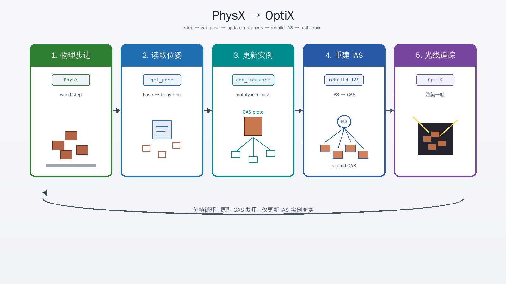
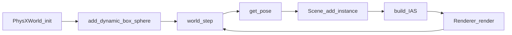

# 09 PhysX 集成

## 物理与画面如何接上？

PhysX 不知道「渲染」；OptiX 不知道「冲量」。本项目约定：

1. PhysX 维护刚体位姿（位置 + 四元数）。
2. 渲染侧为盒/球/吉祥物准备**物体空间原型网格**（各建一个 GAS）。
3. 每帧用位姿填写 `OptixInstance` 变换，重建 **IAS**，再路径追踪。

图注：step → get_pose → 更新实例变换 → 路径追踪。原型 GAS 复用，不再每帧把全部砖块顶点合并进一个大 GAS。

## `PhysXWorld` API（Python / C++）

定义见 `include/nrtx/physx_world.h`：

| 方法 | 含义 |
|------|------|
| `init()` | **仅 GPU**：需要 CUDA + `libPhysXGpu`；失败则抛异常 |
| `add_static_box` | 地面、坡道、墙 |
| `add_dynamic_box` / `add_dynamic_sphere` | 砖、球 |
| `set_linear_velocity` | 给球初速 |
| `step(dt, substeps)` | 推进仿真 |
| `get_pose(id)` | 读位置与四元数 |
| `backend()` | 如 `"gpu"` |

实现：`src/host/physx_world.cpp`（`PxCudaContextManager`、GPU broadphase 等）。

## 位姿如何接到 OptiX？

Python / C++ 场景 API：

| API | 作用 |
|-----|------|
| `Scene.add_mesh(proto)` | 加入物体空间原型，返回 `mesh_index` |
| `Scene.add_instance(mesh_index, pose)` | 用 PhysX `Pose` 实例化该原型（触发 IAS 路径） |

几何辅助（仍可用于非实例场景）：

- 盒子：`make_box` / 旧的 `apply_pose_to_box_mesh`
- 球：`make_uv_sphere` / `apply_pose_to_sphere_mesh`
- OBJ：缩放到原点后 `add_mesh` + `add_instance(template, pose)`

注意：PhysX 碰撞体是**盒/球解析形状**；吉祥物外观是 OBJ，碰撞仍用砖大小的盒子——演示可接受，不是精确网格碰撞。

## 演示：`physx_collapse.py`

1. 建地面、斜坡、围墙。
2. 搭砖塔（约 10×14×10）；部分格子换成 Sparky / Capsule 可视化。
3. 一颗玻璃火球（动态球 + 每帧火焰体积）冲下坡。
4. 每帧：`get_pose` → `add_instance` → `Renderer.render`（日志可见 `IAS: N prototype GAS, M instances`）。
5. 首页 hero 默认对应某一帧（如 `frame_0010`）。

图注：玻璃火球撞塌砖塔（hero 帧）。

## 和渲染同步的代价

- **IAS 路径**：每帧主要重建 IAS（实例变换）；原型 GAS 按网格种类重建，砖块共享同色原型。
- **静态场景**：仍可走单 GAS，只建一次。
- 演示侧重正确性与观感，而非实时 60 FPS。

## 小结

- PhysX 出位姿，OptiX 用 **IAS 实例** 吃这些位姿。
- GPU PhysX 为硬性要求。
- 倒塌 demo 是双栈最完整的故事线。

下一章：[10 Python API 与演示](10-python-api-demos.md)。
