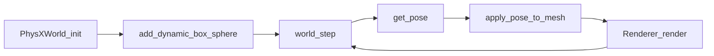

# 09 PhysX 集成

## 物理与画面如何接上？

PhysX 不知道「渲染」；OptiX 不知道「冲量」。本项目约定：

1. PhysX 维护刚体位姿（位置 + 四元数）。
2. 每帧用位姿把**代理几何**变成三角网格。
3. OptiX 只渲染这些三角形。

*图：step → get_pose → 更新网格 → 路径追踪，循环出动画帧。*

## `PhysXWorld` API（Python / C++）

定义见 `include/nrtx/physx_world.h`：

| 方法 | 含义 |
|------|------|
| `init()` | **仅 GPU**：需要 CUDA + `libPhysXGpu`；失败则抛异常 |
| `add_static_box` | 地面、坡道、墙 |
| `add_dynamic_box` / `add_dynamic_sphere` | 砖、球 |
| `set_linear_velocity` | 给球初速 |
| `step(dt, substeps)` | 推进仿真 |
| `get_pose(id)` | 读位置与四元数 |
| `backend()` | 如 `"gpu"` |

实现：`src/host/physx_world.cpp`（`PxCudaContextManager`、GPU broadphase 等）。

## 位姿如何变成网格？

- 盒子：`apply_pose_to_box_mesh(half, pose, mat)`
- 球：`apply_pose_to_sphere_mesh(radius, pose, mat)`
- 任意 OBJ：先缩放到原点，再 `apply_pose_to_mesh(template, pose)`（砖塔里的吉祥物）

注意：PhysX 碰撞体是**盒/球解析形状**；吉祥物外观是 OBJ，碰撞仍用砖大小的盒子——演示可接受，不是精确网格碰撞。

## 演示：`physx_collapse.py`

1. 建地面、斜坡、围墙。
2. 搭砖塔；部分格子换成 Sparky / Capsule 可视化。
3. 一颗玻璃火球（动态球 + 每帧火焰体积）冲下坡。
4. 仿真多步，每隔固定步渲染一帧 → `outputs/physx_collapse/frame_*.png`。
5. 首页 hero 默认对应某一帧（如 `frame_0010`）。

*图：玻璃火球撞塌砖塔（hero 帧）。*

## 和渲染同步的代价

每帧重建（或至少重传）GAS 有开销；演示侧重正确性与观感，而非实时 60 FPS。  
静态场景只需建一次 GAS。

## 小结

- PhysX 出位姿，OptiX 吃三角形。
- GPU PhysX 为硬性要求。
- 倒塌 demo 是双栈最完整的故事线。

下一章：[10 Python API 与演示](10-python-api-demos.md)。
