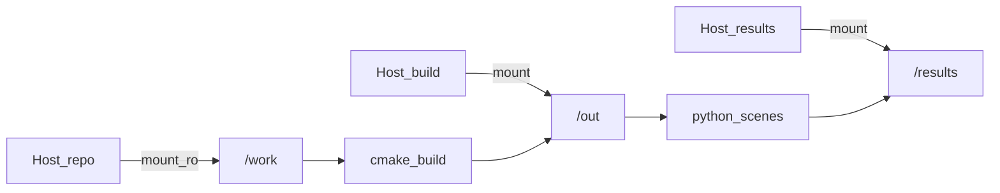

# 11 构建与运行

## 环境要点

- NVIDIA GPU（带 RT Core）
- Docker + CUDA 13 开发镜像（`docker/run.sh` 会准备带 Python 头文件的构建镜像）
- OptiX 头文件在 `third_party/optix`
- PhysX 静态库在 `third_party/physx/lib`，GPU 库 `third_party/physx/bin/libPhysXGpu_64.so`
- Denoiser 权重：`/usr/share/nvidia/nvoptix.bin`（宿主机挂载进容器）

详细说明以仓库根目录 [README.md](../../README.md) 为准。

## 典型命令

```bash
chmod +x docker/run.sh scripts/setup_physx.sh
./scripts/setup_physx.sh   # 若尚未有 PhysX 库

# 配置并编译（CMAKE_CUDA_ARCHITECTURES 按本机 GPU 设定）
./docker/run.sh 'cmake -S /work -B /out -DCMAKE_CUDA_ARCHITECTURES=120 && cmake --build /out -j$(nproc)'

# 渲染示例
./docker/run.sh 'python3 /work/python/scenes/cornell.py /results/cornell.heic 256 1'
./docker/run.sh 'python3 /work/python/scenes/ggx_studio.py /results/ggx_studio.heic 256 1'
./docker/run.sh 'python3 /work/python/scenes/fireplace.py /results/fireplace.heic 256 1'
./docker/run.sh 'python3 /work/python/scenes/physx_collapse.py /results/physx_collapse.heic 96 1'
```

`docker/run.sh` 把仓库挂到 `/work`（只读），构建目录与结果在宿主机临时目录（如 `/tmp/LumenCore-build`、`/tmp/LumenCore-out`），避免 NFS 上以 root 写失败。



*图：容器内路径与宿主机目录的对应关系。*

## 与报告的对应关系

| 你想验证的章节 | 建议命令 |
|----------------|----------|
| 04 GGX / 05 HDRI | `ggx_studio.py` |
| 06 火焰 | `fireplace.py` |
| 06 水 | `water_pool.py` |
| 09 PhysX | `physx_collapse.py` |
| 基础路径追踪 | `cornell.py` |

## 常见坑

- **PhysX init 失败**：检查 GPU 库是否在 `LD_LIBRARY_PATH`（`run.sh` 已设置）。
- **没有图 / 很噪**：提高 spp；确认 denoise=1。
- **改了 `.cu` 不生效**：需重新 `cmake --build`，因为要重编 OptiX-IR。

## 小结

- 日常：用 `docker/run.sh` 编译 + 渲染。
- 结果在 `/results`（宿主机临时目录），需要时再拷回 `outputs/`。

附录：[符号与术语表](appendix-symbols.md)。
