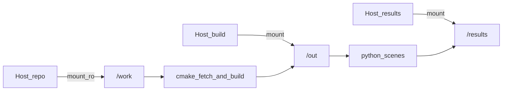

# 11 构建与运行

## 环境要点

- **Linux** + 可用 NVIDIA 驱动（`nvidia-smi` 正常；路径追踪需要 RT Core）
- **Docker** + NVIDIA Container Toolkit（编译器 / CUDA / libavif 在镜像里）
- **首次构建需要网络**：CMake 拉取 OptiX 头、PhysX、pybind11、stb
- Denoiser 权重：宿主机 `/usr/share/nvidia/nvoptix.bin`（挂进容器）

详细说明以仓库根目录 [README.md](../../README.md) 为准。

## 典型命令

```bash
chmod +x scripts/build.sh docker/run.sh

# 一键配置 + 编译（第三方依赖在 configure 时拉取；PhysX 首次较慢）
./scripts/build.sh
# 产物：/tmp/LumenCore-build/python/lumencore*.so
# PhysX：/tmp/LumenCore-build/_deps/physx

# 渲染示例
./docker/run.sh 'python3 /work/python/scenes/cornell.py /results/cornell.avif 256 1'
./docker/run.sh 'python3 /work/python/scenes/ggx_studio.py /results/ggx_studio.avif 256 1'
./docker/run.sh 'python3 /work/python/scenes/fireplace.py /results/fireplace.avif 256 1'
./docker/run.sh 'python3 /work/python/scenes/physx_collapse.py /results/physx_collapse.avif 96 1'
```

`docker/run.sh` 把仓库挂到 `/work`（只读），构建目录与结果在宿主机临时目录（如 `/tmp/LumenCore-build`、`/tmp/LumenCore-out`），避免 NFS 上以 root 写失败。`LD_LIBRARY_PATH` 会包含 `<build>/_deps/physx/bin` 以便加载 `libPhysXGpu_64.so`。



*图：容器内路径与宿主机目录的对应关系。*

## 与报告的对应关系

| 你想验证的章节 | 建议命令 |
|----------------|----------|
| 04 GGX / 05 HDRI | `ggx_studio.py` |
| 06 火焰 | `fireplace.py` |
| 06 水 | `water_pool.py` |
| 09 PhysX | `physx_collapse.py` |
| 基础路径追踪 | `cornell.py` |

## 常见坑

- **PhysX init 失败**：检查 `<build>/_deps/physx/bin/libPhysXGpu_64.so` 是否在 `LD_LIBRARY_PATH`（`run.sh` 已设置）。
- **没有图 / 很噪**：提高 spp；确认 denoise=1。
- **改了 `.cu` 不生效**：需重新 `cmake --build`，因为要重编 OptiX-IR。
- **离线构建**：`-DLUMENCORE_FETCH_DEPS=OFF` 并提供 `-DOPTIX_INCLUDE_DIR` / `-DPHYSX_ROOT` / `-DSTB_INCLUDE_DIR`。

## 小结

- 日常：`./scripts/build.sh` 编译，再用 `docker/run.sh` 跑场景。
- 结果在 `/results`（宿主机临时目录），需要时再拷回 `outputs/`。

附录：[符号与术语表](appendix-symbols.md).
